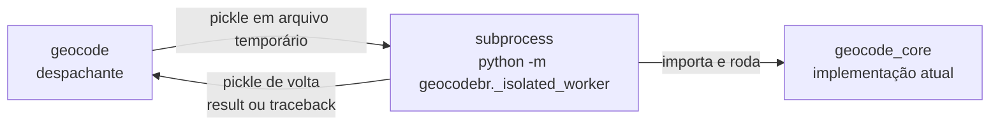

# Python — Isolamento em subprocesso para `geocode()` — deterioração de tempo entre chamadas sucessivas

**Data:** 2026-09-02
**Status:** PROPOSTO — diagnóstico **fechado em 04/09: heap NT do processo hospedeiro (Windows); ver**
[`diagnoses/2026-09-04_geocode-deterioracao-python-diagnostico.md`](../diagnoses/2026-09-04_geocode-deterioracao-python-diagnostico.md)**.
Este documento trata apenas da implementação. Nenhum código foi alterado.

## Sintoma

Benchmark com `geocode()` rodado 10 vezes no mesmo processo Python
(`data/consolidado_info.parquet`, `resultado_completo=True`, `resolver_empates=True`,
`verboso=False`):

| rodada | tempo (min) |
|---|---|
| 1 | 2,86 |
| 2 | 3,96 |
| 3 | 5,84 |
| 4 | 7,30 |
| 5 | 10,94 |
| 6 | 14,28 |
| 7 | 17,77 |
| 8 | 20,07 |
| 9 | 25,22 |
| 10 | 30,75 |

Crescimento **linear e acumulativo** (~+3 min por rodada), sem alteração no código entre
rodadas e com cada chamada fechando a própria conexão DuckDB (`finally: con.close()`).

## Diagnóstico

**Atualizado em 2026-09-03 com evidência experimental** (3 benchmarks; input de ~7,83 milhões
de endereços, `data/consolidado_info.parquet`, `resultado_completo=True`,
`resolver_empates=True`, `verboso=False`). A hipótese de memória da redação original foi
**refutada**; a conclusão (isolar cada chamada em processo novo) foi **confirmada**.

### Evidência 1 — deterioração in-process sem crescimento de memória

5 rodadas no mesmo processo, medindo tempo e RSS antes/pico/pós-`gc.collect()`:

| rodada | tempo (min) | RSS antes (GB) | RSS pico (GB) | RSS pós-gc (GB) |
|---|---|---|---|---|
| 1 | 3,11 | 0,42 | 11,13 | 6,98 |
| 2 | 5,67 | 6,98 | 8,45 | 4,30 |
| 3 | 8,09 | 4,30 | 7,50 | 3,34 |
| 4 | 10,31 | 3,34 | 7,42 | 3,26 |
| 5 | 12,13 | 3,26 | 8,41 | 4,26 |

O tempo degrada (~+2,3 min/rodada, 3,9× na rodada 5), mas o RSS retido **não cresce** — cai
após a rodada 1 e estabiliza (3,3–4,3 GB). Pelo critério que a redação original estabelecia
("RSS crescente rodada a rodada confirma o diagnóstico"), a hipótese de memória está refutada.

### Evidência 2 — subprocesso por rodada: tempos planos

Cada rodada em interpretador recém-criado (tempo medido dentro do filho, excluindo o
startup; mesmo input; **sem** nenhum patch de heap): tempos planos no patamar da rodada 1.

| rodada | in-process (min) | subprocesso novo (min) |
|---|---|---|
| 1 | 3,11 | 3,07 |
| 2 | 5,67 | 3,03 |
| 3 | 8,09 | 2,87 |
| 4 | 10,31 | 2,81 |
| 5 | 12,13 | 2,88 |

Razão rodada 5 / rodada 1: **3,90×** (in-process) vs **0,94×** (subprocesso). Nos filhos
isolados, commit privado basal constante (0,86 GB) e pico plano (7,1–7,6 GB).

### Evidência 3 — commit privado estável no processo único

3 rodadas in-process em sessão recém-criada, medindo *commit charge* privado
(`psutil.Process().memory_full_info().private` — no Windows, mais completo que o RSS, que
é apenas working set) e a memória do sistema a cada rodada (409 GB de RAM disponíveis;
commit do sistema estável em 9,6/40,2 GB):

| rodada | tempo (min) | commit antes (GB) | commit pico (GB) | commit pós-gc (GB) |
|---|---|---|---|---|
| 1 | 3,00 | 0,95 | 11,39 | 6,43 |
| 2 | 4,90 | 6,43 | 12,95 | 8,01 |
| 3 | 7,66 | 8,01 | 11,78 | 6,78 |

O commit retido não acumula entre rodadas (6,43 → 8,01 → 6,78 GB) e o pico é plano
(11,4–13,0 GB): a degradação de tempo **não** acompanha nenhuma métrica de memória.

### Evidência 4 — A/B do heap do interpretador (mesmo processo, mesmo venv)

03/09, com o `.venv` do repositório (CPython 3.10.20/uv, duckdb 1.5.3, polars 1.44.0),
o mesmo script (`verifica_segment_heap_geocode.py`) sobre `data/sample_cad_unico.parquet`
(10 milhões de endereços), 5 rodadas in-process, variando **apenas o exe**:

| rodada | `python.exe` (heap NT) (min) | `python-sh.exe` (SegmentHeap) (min) |
|---|---|---|
| 1 | 13,11 | 2,88 |
| 2 | 55,91 | 2,90 |
| 3 | 105,18 | 2,88 |
| 4 | 147,89 | 2,79 |
| 5 | 167,77 | 2,83 |

Razão rodada 5/1: **12,8×** (NT) vs **0,98×** (SegmentHeap). Com SegmentHeap, até a
rodada 1 é 4,6× mais rápida que a do NT (2,88 vs 13,11 min) — o heap do exe hospedeiro
afeta tanto o **nível** de performance quanto a **deterioração**. Verificação de
integridade do A/B: inspeção binária dos exes confirmou `<heapType>SegmentHeap</heapType>`
(UTF-8, dentro de `windowsSettings` do RT_MANIFEST) **apenas** no `python-sh.exe` — o
manifest é o único diferencial entre os braços do experimento.

Nota sobre bases e versões (03/09): `consolidado_info.parquet` (7,8M, só Pernambuco) e
`sample_cad_unico.parquet` (10M, amostra aleatória do Brasil) **não são comparáveis entre
si** — a abrangência geográfica muda o mix de fases do matching. Comprovado em 03/09: 1
rodada do `sample_cad_unico` no CPython 3.13.7 sem patch, processo recém-criado, levou
**11,49 min** — patamar compatível com os 13,11 min do 3.10 sem patch na mesma base.
Ou seja: não há efeito inexplicado de versão do CPython no nível; o patamar absoluto
varia com a natureza da base, e o heap governa nível (dentro da mesma base) e deterioração.
Para referência de escala, na base completa `cad_unico.parquet` (43M): 1,6 h no 3.13 sem
patch vs 11 min no 3.10 com patch. A deterioração, por fim, manifesta-se em qualquer base
(12,8× no 3.10/`sample`, 3,9× no 3.13/`consolidado_info`).

### Diagnóstico revisado

- **Causa**: **heap NT do processo hospedeiro (Windows)** — identificado em 04/09 pelo
  A/B da Evidência 4 (mesma base/venv, só o exe muda: NT degrada 12,8×; SegmentHeap fica
  plano e ainda 4,6× mais rápido na rodada 1). O heap é fixado no image load pelo
  manifest do exe; não é memória retida (E1, E3) nem versão do CPython. Detalhamento
  completo em
  [`quality_reports/diagnoses/2026-09-04_geocode-deterioracao-python-diagnostico.md`](../diagnoses/2026-09-04_geocode-deterioracao-python-diagnostico.md).
  As hipóteses da redação original (spill por pressão de memória, alocadores Python
  progressivamente "sujados") permanecem refutadas pelas Evidências 1 e 3.
- **Resolução**: recriar o processo. Isolar cada `geocode()` em subprocesso devolve os
  tempos ao patamar da rodada 1 de forma reprodutível (Evidência 2), independentemente do
  mecanismo — mesma inferência do `callr::r()` no R (`r-package/R/geocode.R:89-130`).
- **Mantém-se da redação original (verificado e descartado)**: no Python, `geocode()`
  executa tudo no processo do usuário (`python-package/geocodebr/geocode.py`); não há
  cache global em nível de módulo — as tabelas CNEFE são `TEMP TABLE` por conexão
  (`tables.py`, morrem no `con.close()`); `cache.py` só lida com config/pasta de cache em
  disco; conexões fechadas corretamente no `finally` (`geocode.py:189-191`).
- **Achado colateral**: cada chamada deixa 1 arquivo `.duckdb` vazio (0 bytes) no
  `%TEMP%` (208 acumulados na data dos benchmarks, inclusive de chamadas que falharam) —
  vazamento cosmético em `db.py` (o `NamedTemporaryFile` + `unlink` não cobre a recriação
  do arquivo pelo DuckDB), sem efeito de performance. Corrigir em PR próprio.
- **Implicação para o SegmentHeap (seção abaixo)** — **revisada em 03/09** à luz da
  Evidência 4: o heap do exe hospedeiro é o fator que governa tanto o nível de cada
  chamada (4,6× na rodada 1, venv 3.10) quanto a deterioração (plana com SegmentHeap;
  12,8× sem). O patch **integra** a solução, em vez de ser feature separada: o worker
  isolado deve ser lançado com a cópia `python-sh.exe` quando disponível — o isolamento
  garante estado de processo novo por chamada (Evidência 2, onde o 3.13 sem patch já
  atinge o patamar rápido) e o SegmentHeap garante o nível de cada chamada no venv 3.10,
  onde o isolamento sozinho nasceria no patamar lento (~13 min por rodada, predição não
  medida). O fallback sem patch permanece obrigatório (pastas sem permissão, AV/WDAC).

## Solução proposta: espelhar o `callr::r()` com `subprocess`

Estrutura (mesma separação do R):



Por que `subprocess.run` + handshake por arquivo (em vez de `multiprocessing`):

- não exige `if __name__ == "__main__"` no script do usuário (spawn no Windows importa o
  `__main__`; o handshake por arquivo evita as pegadinhas do spawn);
- sem limite de tamanho de pickle por pipes (resultado grande vai por disco);
- `stdout`/`stderr` do filho são herdados: mensagens verbosas e barra `tqdm` aparecem igual;
- `pa.Table` (retorno atual) é picklable.

Custo: ~1–3 s por chamada (interpretador + imports) — irrelevante em rodadas de minutos,
 perceptível em testes (tratado abaixo).

### Sugestão de código

**1) `python-package/geocodebr/_isolated.py` (novo)** — lado do processo pai:

```python
"""Execução de `geocode_core()` em subprocesso isolado.

Espelha o `callr::r()` do pacote R: cada chamada de `geocode()` roda em um
processo Python recém-criado, de modo que toda a memória e recursos usados
por DuckDB/polars/enderecobr sejam devolvidos ao SO ao final da chamada.
Sem isso, chamadas sucessivas no mesmo processo ficam progressivamente
mais lentas (deterioração linear observada em benchmarks).

A comunicação é feita por pickle em arquivos temporários: o pai serializa os
kwargs, o filho (`geocodebr._isolated_worker`) executa `geocode_core()` e
devolve o resultado ou o traceback. O stdout/stderr do filho é herdado, então
mensagens verbosas e a barra de progresso aparecem normalmente.
"""

from __future__ import annotations

import os
import pickle
import subprocess
import sys
import tempfile
from typing import Any


def run_isolated(kwargs: dict[str, Any]) -> Any:
    """Roda `geocode_core(**kwargs)` em um subprocesso recém-criado."""
    with tempfile.TemporaryDirectory(prefix="geocodebr_isolado_") as tmp:
        args_path = os.path.join(tmp, "args.pkl")
        result_path = os.path.join(tmp, "result.pkl")

        with open(args_path, "wb") as f:
            pickle.dump(kwargs, f, protocol=pickle.HIGHEST_PROTOCOL)

        proc = subprocess.run(
            [sys.executable, "-m", "geocodebr._isolated_worker", args_path, result_path],
            env=_child_env(),
            check=False,
        )

        if not os.path.exists(result_path):
            raise RuntimeError(
                "O processo isolado do geocode() não retornou resultado "
                f"(exit code {proc.returncode}). Verifique a saída acima."
            )

        with open(result_path, "rb") as f:
            payload = pickle.load(f)

    if payload["traceback"] is not None:
        raise RuntimeError(
            "geocode() falhou no processo isolado:\n" + payload["traceback"]
        )
    return payload["result"]


def _child_env() -> dict[str, str]:
    """Ambiente do filho com PYTHONPATH garantindo que `geocodebr` seja importável.

    Necessário quando o pacote é usado direto da fonte, sem instalação no env.
    """
    env = os.environ.copy()
    paths = list(dict.fromkeys(sys.path))
    existing = env.get("PYTHONPATH")
    if existing:
        paths = [*existing.split(os.pathsep), *paths]
    env["PYTHONPATH"] = os.pathsep.join(p for p in paths if p)
    return env
```

**2) `python-package/geocodebr/_isolated_worker.py` (novo)** — ponto de entrada do filho:

```python
"""Ponto de entrada do subprocesso isolado usado por `geocode()`.

Uso: `python -m geocodebr._isolated_worker <args.pkl> <result.pkl>`

Roda `geocode_core()` em um interpretador recém-criado (equivalente ao
`callr::r()` do pacote R) e devolve o resultado, ou o traceback em caso de
erro, via pickle. O processo pai invoca este módulo; ele nunca deve ser
executado diretamente pelo usuário.
"""

from __future__ import annotations

import pickle
import sys
import traceback


def main(argv: list[str]) -> int:
    args_path, result_path = argv[1], argv[2]

    with open(args_path, "rb") as f:
        kwargs = pickle.load(f)

    payload = {"result": None, "traceback": None}
    try:
        from geocodebr.geocode import geocode_core

        payload["result"] = geocode_core(**kwargs)
    except BaseException:  # repassa qualquer falha ao processo pai
        payload["traceback"] = traceback.format_exc()

    with open(result_path, "wb") as f:
        pickle.dump(payload, f, protocol=pickle.HIGHEST_PROTOCOL)
    return 0


if __name__ == "__main__":
    sys.exit(main(sys.argv))
```

**3) `python-package/geocodebr/geocode.py` (modificar)** — renomear a implementação atual
(linhas 52–191) para `geocode_core()`, mantendo a assinatura idêntica, e transformar
`geocode()` no despachante:

```python
import os

from ._isolated import run_isolated


def geocode(
    enderecos,
    campos_endereco=None,
    resultado_completo=False,
    resolver_empates=True,
    resultado_sf=False,
    h3_res=None,
    padronizar_enderecos=True,
    verboso=True,
    cache=True,
    n_cores=None,
):
    """(... docstring atual ...)"""

    kwargs = dict(
        enderecos=enderecos,
        campos_endereco=campos_endereco,
        resultado_completo=resultado_completo,
        resolver_empates=resolver_empates,
        resultado_sf=resultado_sf,
        h3_res=h3_res,
        padronizar_enderecos=padronizar_enderecos,
        verboso=verboso,
        cache=cache,
        n_cores=n_cores,
    )

    # isola cada chamada em processo novo (equivalente ao callr::r() do R).
    # GEOCODEBR_ISOLAR=0 desativa (uso em testes/debug).
    if os.environ.get("GEOCODEBR_ISOLAR", "1") == "0":
        return geocode_core(**kwargs)

    return run_isolated(kwargs)


def geocode_core(enderecos, campos_endereco=None, resultado_completo=False, ...):
    # corpo ATUAL de geocode() — inalterado
    ...
```

(Atenção à assinatura de `geocode_core`: espelhar exatamente os parâmetros e defaults de hoje.)

## Integração SegmentHeap no subprocesso (duckdb/duckdb#24027)

**Contexto** (descoberto em 02/09; ver `python-package/benchmarks/resultados_benchmark.md` e
`MEMORY.md`): no Windows, o desempenho do DuckDB é definido pelo **heap do processo que o
hospeda** — heap NT legacy (padrão do `python.exe`) serializa alocação/free multithread e piora
com mais threads; **Segment Heap** (opt-in via manifest embutido no exe) escala. É a causa raiz
do Python ser ~4× mais lento que o R em materialização no Windows (o `Rscript.exe` já opta pelo
Segment Heap; fix upstream duckdb#24036 cobre só o CLI; **releases do DuckDB nunca resolverão o
lado Python** — o manifest pertence ao exe hospedeiro).

Com o subprocesso, **o pacote passa a escolher qual exe nasce o worker** — e pode lançá-lo com
uma cópia do interpretador com manifest SegmentHeap, **sem tocar no `python.exe` do usuário**.
Isolamento (anti-deterioração) e heap (velocidade) numa única mudança arquitetural.

### 1. Resolução do interpretador real (pegadinha do launcher)

Em venv, `sys.executable` é o **launcher** (`Scripts\python.exe`) — o processo que de fato executa
o trabalho é o `python.exe` **base** (`pyvenv.cfg` → `home`), e é o manifest *dele* que decide o
heap. O worker deve ser lançado diretamente contra o exe real:

```python
def _resolve_real_interpreter() -> Path:
    exe = Path(sys.executable).resolve()
    if sys.prefix != sys.base_prefix:  # venv: exe real vive no base_prefix
        candidate = Path(sys.base_prefix) / "python.exe"
        if candidate.is_file():
            return candidate
    return exe  # layout desconhecido (conda etc.): usa sys.executable
```

Non-Windows: heap irrelevante (jemalloc cobre); `sys.executable` basta.

### 2. Cópia patcheada: criação, validade e fallback

- Primeiro uso em Windows (e `GEOCODEBR_SEGMENTHEAP != "0"`): aplicar o patch de manifest sobre
  o exe real → `python-geocodebr-sh.exe` **ao lado do original** (o exe copiado depende de
  `pythonXY.dll`/`Lib` adjacentes — copiar para outra pasta **não** funciona sem validação
  extra de reloc; fora de escopo aqui). O patch segue a técnica do `patch_segment_heap.py`
  da reprodução de duckdb#24027 (mesma casa — Ipea): ~60 linhas stdlib, edição size-preserving
  dentro do resource RT_MANIFEST, escreve **cópia nova** sem tocar no original.
- **Permissão**: pasta base não-gravável (ex.: Program Files) → degradar para subprocesso sem
  patch + aviso `verboso` (a isolation já entrega a maior parte do anti-deterioração). Erro
  qualquer no patch → mesmo fallback; a chamada nunca quebra por causa disso.
- **Validade**: se o hash do exe origem mudar (upgrade do interpretador), re-patch; se o
  original já contiver `SegmentHeap` (futuro CPython), não criar cópia. Sidecar
  `<nome>-sh.exe.sha256` para baratear a checagem.
- **Remoção/documentação**: o arquivo é apagável; README do porte explica o que é, por quê e
  como desligar.

### 3. Ambiente do filho (pegadinha do `.pth`, validada em 02/09)

Exe base + `PYTHONPATH`→site-packages **não processa `.pth`** — instalação **editável** do
geocodebr não resolve (o import falha: verificado). O `_child_env()` da sugestão de código deve,
portanto:

1. colocar em primeiro no `PYTHONPATH` a **raiz do código que o pai importou**
   (`Path(geocodebr.__file__).parents[1]`) — garante que o filho roda a *mesma* versão do
   pacote;
2. em seguida as demais entradas de `sys.path` do pai (com `''` resolvido para `os.getcwd()`);
3. reconciliar com `PYTHONPATH` pré-existente como já esboçado.

Com isso o worker roda mesmo em instalações editáveis/direto-da-fonte.

### 4. Flags

| flag | default | efeito |
|---|---|---|
| `GEOCODEBR_ISOLAR` | `1` | `0` roda tudo no processo do usuário (testes/debug; usado pelo fixture `autouse` da suíte) |
| `GEOCODEBR_SEGMENTHEAP` | `1` (Windows) | `0` lança o worker com o interpretador comum, sem criar/usar cópia patcheada (AV corporativo restritivo, debug) |

Non-Windows ignora SegmentHeap (não cria cópia, não avisa).

### 5. Observabilidade

Com `verboso=True`, o worker imprime na primeira linha algo como:
`[geocodebr] worker em processo isolado (python X.Y.Z · SegmentHeap: sim/não/não aplicável)` —
o usuário sempre consegue auditar qual interpretador rodou de fato.

### 6. Delta sobre a sugestão de código acima

- `run_isolated`: `[sys.executable, ...]` vira `[worker_exe, ...]`, onde `worker_exe` = cópia
  SegmentHeap resolvida (Windows + flag) ou exe real; mesmo comportamento de erro/resultado.
- No worker: linha de banner (item 5) antes de importar/executar.

### 7. Validação adicional (soma ao §Validação)

1. 10 rodadas em **três** modos — (a) hoje, in-process; (b) isolado sem heap; (c) isolado com
   heap — esperado: (a) degrada linearmente (reproduz tabela acima), (b) plano no patamar da
   rodada 1, (c) plano e mais baixo. Publicar a tabela em `resultados_benchmark.md`.
2. `benchmark_sample.py` (10M) no modo padrão (isolado+heap): fases ≈ às da linha `patch_heap`
   medida em 02/09 (total 3:08) — confirma que a arquitetura preserva o ganho end-to-end.
3. Checagem de RSS (item 1 do §Validação original) nas três configurações.

### 8. Riscos adicionais

- **Antivírus corporativo** pode estranhar um exe modificado → flag + documentação; fallback
  nunca quebra a chamada.
- **Pastas não-graváveis** → fallback com aviso; reloc da cópia via `PYTHONHOME`/`PATH` é
  trabalho futuro **condicionado a validação** (não prometido nesta fase) — cobriria só a
  minoria com Python em pasta de admin; o isolamento por si já elimina a deterioração.

## Impacto nos testes existentes

- `test_regression_news_port.py::test_geocode_cache_false_uses_temp_dir` usa
  `patch.object(geocode_mod, "download_cnefe", ...)` — **mock não atravessa a fronteira do
  processo**. Com o flag `GEOCODEBR_ISOLAR=0`, o teste continua funcionando como hoje.
- Sugestão: fixture `autouse` no `conftest.py` desativando o isolamento na suíte inteira
  (testes rápidos, mocks funcionam), e um teste novo dedicado que roda **com** isolamento
  para travar o comportamento:

```python
# conftest.py (adicionar)
@pytest.fixture(autouse=True)
def _no_process_isolation(monkeypatch):
    monkeypatch.setenv("GEOCODEBR_ISOLAR", "0")
```

- O teste de paridade (`test_r_python_parity.py`) não é afetado: `definir_pasta_cache()` grava
  a config **em arquivo** (`cache.py:46-62`), que atravessa processos; `_run_python_geocode`
  continua funcionando com isolamento ligado.
- Nenhum input suportado (`str`/`Path`, `pa.Table`, `pl.DataFrame`, `pd.DataFrame`) deixa de ser
  picklable.

## Alternativas consideradas

1. **Workaround no script do usuário** — rodar cada rodada em um `python` separado (loop no
   shell/subprocess). Resolve, mas empurra o problema para quem consome o pacote.
2. **`ProcessPoolExecutor(max_workers=1, max_tasks_per_child=1)`** (Python 3.11+) — efeito
   equivalente com API mais pesada; exige pickling por pipes e `__main__` guard nos scripts.
3. **Pool persistente quente** — rejeitado: reintroduz a deterioração após N tarefas.
4. **Tuning do DuckDB (`memory_limit` etc.)** — mitiga, não garante; não endereça fragmentação
   dos alocadores Python nem o comportamento do SO no Windows.

## Validação

1. ~~Confirmar a hipótese de memória~~ — **executado em 03/09**: nem RSS nem commit
   privado crescem entre rodadas; hipótese de memória refutada e isolamento confirmado
   (ver §Diagnóstico, Evidências 1–3). Itens 2–4 abaixo seguem pendentes (pós-patch).

2. Aplicar o patch e re-rodar o benchmark das 10 rodadas. Esperado: tempos **planos**
   (~ tempo da rodada 1 ± ruído), pois cada rodada parte de um processo recém-criado.
3. Rodar a suíte com o fixture `autouse` (22/22 devem passar) + o teste novo de isolamento.
4. Paridade R↔Python inalterada.

## Riscos / pontos de atenção

- **Overhead por chamada** (~1–3 s de startup do interpretador): proporcionalmente
  desprezível em cargas de minutos; justifica o flag para testes minúsculos.
- **Erros viram string**: o traceback completo do filho é repassado e relançado como
  `RuntimeError` (mensagem idêntica à de um erro in-process, com traceback anexado).
- **`n_cores`/threads**: sem mudança — o filho herda a configuração via `create_geocodebr_db`.
- **Dados em `%TEMP%`**: o `TemporaryDirectory` é limpo no fim; em kill -9 pode restar lixo
  (mesmo comportamento dos `.duckdb` temporários atuais).
- `busca_por_cep()` e `geocode_reverso()` **não** são isolados — no R o `callr` também cobre
  apenas `geocode()`. Se a deterioração se repetir neles, o mesmo padrão se aplica.
