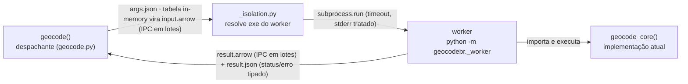

# Plano de ação — `geocode()` Python no Windows: deterioração entre chamadas + nível absoluto

**Data:** 2026-09-08 · **Status:** PROPOSTO — **revisão v3 (2026-09-09)**: Fase 0b (probe IPC) executada, protocolo do worker sem pickle, isolamento Windows-only, `GEOCODEBR_WORKER_PY` removido — detalhes nas decisões 4–7. (A v2 de 2026-09-08 definiu o escopo enxuto original.)
**Insumos:** [diagnóstico fechado](../diagnoses/2026-09-04_geocode-deterioracao-python-diagnostico.md) (E1–E5) · [plano antigo de isolamento](2026-09-02_python_isolamento-subprocesso-geocode.md) (substituído por este)

> **Revisão v4 (2026-09-10) — escopo da v1 reduzido.** O subprocesso (Fase 1) só resolve a
> **deterioração entre chamadas**, e foi adiado para a v2. A v1 entregou apenas:
> (a) aviso once-per-session de heap legacy (`geocodebr/_heap.py`, emitido na 1ª chamada de
> `geocode()`); (b) script do tutorial `python -m geocodebr._heap_patch` (`geocodebr/_heap_patch.py`,
> patch size-preserving do RT_MANIFEST que cria `python-geocodebr-sh.exe` ao lado do interpretador
> base — validado contra o exe real do uv; `GetProcessHeap`/`HeapQueryInformation` reporta 0 (legacy)
> até no exe patcheado que performa bem, então a detecção lê o manifesto, não o heap); (c) cap de
> `n_cores` para 4 no Windows sem Segment Heap quando o usuário não define `n_cores`
> (`n_cores_efetivo()`); (d) seção "Windows e performance" no README + testes (`tests/test_heap.py`).
> Fases 1, 3 e 4 do plano seguem como alvo da v2, junto com a adoção automática da seção v2 abaixo.
**Decisões já tomadas com o usuário:**
1. **Isolar sempre** — cada `geocode()` roda em subprocesso novo em **todos** os SOs (paridade total com o `callr::r()` do R; Linux/macOS pagam ~1–3 s de overhead sem benefício de performance, aceito).
2. ~~Cadeia de fallbacks para o heap~~ — **P0 executado em 2026-09-08, resultado NEGATIVO**: `__COMPAT_LAYER=SEGMENTHEAP` não altera o desempenho (gap 1,14×/1,16× contra critério ≥ 2×; detalhes na Fase 0 e em `resultados_benchmark.md`).
3. **Escopo v1 enxuto (2026-09-08, ajustado em 09/09)** — v1 entrega isolamento + detecção de heap com aviso + tutorial com script embutido (`python -m geocodebr._heap_patch`). O **patch automático fica descrito para a v2** (seção própria no fim), sem implementação agora.
4. **Isolamento Windows-only com escape (2026-09-09)** — default ligado só no Windows: E5 mostrou a deterioração só lá, e Linux/macOS pagariam custo sem benefício. `GEOCODEBR_ISOLAR` vira **tri-state**: unset = default da plataforma, `1` = força o subprocesso, `0` = roda in-process. Para não perder cobertura, a CI roda parte da suíte no Linux com `GEOCODEBR_ISOLAR=1` (job rápido; ver Fase 3).
5. **Sem pickle na fronteira (2026-09-09, pós-Fase 0b)** — controle via **JSON** (`args.json`, `result.json` com status/erro tipado `{tipo, mensagem, traceback}`), tabelas via **Arrow IPC em lotes de ~1M linhas**; o pai recria as exceções conhecidas. O pickle desaparece da fronteira inteira (velocidade + sem `unpickle` como superfície de código + sem acoplamento de ABI).
6. **`GEOCODEBR_WORKER_PY` removido (2026-09-09)** — aceitar exe arbitrário exigia validação de versão/ABI que não vale o escopo. v1 fica: aviso de heap legacy + tutorial com o script **embutido** no pacote; o ganho de nível requer iniciar a sessão com o exe patcheado (limitação venv/Jupyter documentada e assumida; a v2 traz a adoção automática).
7. **Detecção de heap lendo o RT_MANIFEST (2026-09-09)** — scan de bytes do exe inteiro dá falso positivo (string `SegmentHeap` fora do manifest silencia o aviso); a leitura correta é a do resource RT_MANIFEST.

## Diagnóstico em uma linha

O heap NT legacy do `python.exe` (fixado no image load pelo manifest, imutável em runtime) degrada sob alocação/liberação multithread intensa do DuckDB: deterioração progressiva entre chamadas no mesmo processo (E4: 12,8×) **e** nível absoluto 4,6× pior por chamada. Isolar o processo zera a deterioração; optar o worker pelo Segment Heap devolve o nível (total 11:47 → 3:08 na base 10M). Windows-only (E5).

## Arquitetura (v1)



O worker herda `stdout`/`stderr` quando `verboso=True` (tqdm e mensagens aparecem) e roda no interpretador **base** resolvido (pegadinha do launcher de venv); com `verboso=False` o stderr é capturado e anexado a qualquer falha. Entrada por **caminho de arquivo** não é serializada: atravessa como string. O worker **apaga `input.arrow` logo após ler** (higiene: o staging contém os dados do usuário) e o pai remove pastas órfãs antigas. O pacote **nunca** escreve no diretório do interpretador na v1 — o script `_heap_patch` cria a cópia **por ação explícita do usuário**, e o ganho de nível com Segment Heap requer iniciar a sessão com essa cópia (receita no README; ver Riscos).

### Resolução do exe e do isolamento

| situação | comportamento |
|---|---|
| non-Windows | in-process, sem worker (`GEOCODEBR_ISOLAR=1` força o subprocesso, p/ testes e diagnose) |
| Windows + exe que já declara SegmentHeap (futuro CPython) | worker = exe real (nada a fazer) |
| Windows + app frozen (`sys.frozen`) | desiste do isolamento com aviso e roda in-process |
| Windows + heap legacy (caso comum) | worker = exe real + **aviso** uma vez por sessão, com a receita do README (`python -m geocodebr._heap_patch`) |

Detecção de heap: leitura do resource **RT_MANIFEST** do exe resolvido, procurando `<heapType>SegmentHeap</heapType>` dentro dele (não o scan de bytes do exe inteiro — a string solta em outra seção daria falso positivo e silenciaria o aviso); o banner do worker informa o estado (`SegmentHeap: sim/não/não aplicável`). A estratégia `__COMPAT_LAYER=SEGMENTHEAP` foi testada e **descartada** — ver Fase 0.

---

## Fase 0 — Probe `__COMPAT_LAYER` (P0) — EXECUTADO 2026-09-08: SEM EFEITO

Probe implementado em `python-package/benchmarks/verifica_segment_heap_compat.py`
(workload canônico da issue, 8M × 6 joins, rodadas intercaladas NT/SH, 3 repetições
por configuração; smoke de 1M linhas não discrimina os heaps — usar a escala cheia).
Resultado na máquina de referência (Windows Server 2022, CPython 3.13.7, duckdb 1.5.3):

| threads | NT mediana | SH (`__COMPAT_LAYER`) mediana | gap | critério |
|---|---|---|---|---|
| 8 | 37,19 s | 32,52 s | 1,14× | ≥ 2× |
| 24 | 38,85 s | 33,60 s | 1,16× | ≥ 2× |

Sem efeito: os dois braços ficam no mesmo patamar, longe da referência do exe
patcheado (~8,9–9,7 s em 8t; ~7–7,7 s em 24t), e ambos exibem a assinatura do heap
legacy (joins cada vez mais lentos, ~1 s → ~11 s; mais threads não ajuda).

Observação de API (não muda o veredito): com o layer no env, `HeapQueryInformation`
classe `HeapCompatibilityInformation` sobre o heap *default* do processo retorna
2 (Segment Heap) — o shim **é aplicado** ao heap default, mas o wall do duckdb não
muda. Hipótese mecânica mais consistente: o shim não alcança o heap criado pelo
UCRT no startup (`HeapCreate`), por onde passam as alocações do duckdb
(`_malloc_base` → `HeapAlloc(_crtheap)`); o opt-in via manifest (E4) é
process-wide e por isso funciona. Implicação prática: o caminho viável é o
manifest no exe hospedeiro (v1: opt-in manual; v2: automático).

**Melhoria em relação ao plano antigo:** a aposta zero-custo foi descartada por
evidência antes de qualquer implementação no pacote — sem risco de code path morto.

**Adendo (2026-09-10) — via registro (`AppCompatFlags\Layers` / IFEO) também sem efeito.**
Teste pareado na mesma janela, mesmo harness (`--threads 8 --repeticoes 3`, duckdb 1.5.3):
sem layer 20,0 s · com layer persistido no registro (`HKCU\...\AppCompatFlags\Layers`,
entrada pelo caminho do exe, base e venv) 18,9 s — gap 1,07×, ambos com a assinatura de
deterioração do heap legacy (1º join 1,2 s → último ~6 s). Controle positivo no mesmo
momento: exe cópia patcheado 8,4 s com joins planos (1,2 → 1,6 s). IFEO
(`HKLM\...\Image File Execution Options`) usa o mesmo motor de shims da camada de
compatibilidade — o registro só persiste o layer, não muda o escopo dele. Única rota
que alcança o heap do startup: o manifesto (lido no image load).

## Fase 0b — Probe IPC: Arrow × pickle no handoff (P1) — EXECUTADO 2026-09-09: ARROW EM LOTES

Antes de fixar o protocolo do worker, medir o custo de ida e volta das tabelas
(pai → filho → pai) no interpretador **sem patch** (heap NT legacy — o default dos
usuários). Harness: `benchmarks/verifica_arrow_ipc.py` (self-contained, dados sintéticos
CadÚnico-like; o filho espelha os imports do worker real e apaga o input após ler).
Tabela completa, cenário e notas em `benchmarks/resultados_benchmark.md`; rodadas em
`benchmarks/resultados_probe_ipc.csv`. Números-chave (medianas, TOTAL inclui startup):

| linhas | melhor formato | TOTAL | pickle (comparação) | custo relativo |
|---|---|---|---|---|
| 10M | Arrow IPC (lotes) | ~18–19 s | pickle pandas 26,5 s · polars 28,7 s | ~10% do alvo 3:08 (I/O puro ~5,5%) |
| 43M | Arrow IPC em lotes | **36,4 s** | pickle pandas 132,6 s | ~5,5% dos ~11 min do 43M+heap |

Achados que moldam a Fase 1:

1. **Arrow IPC em lotes de ~1M linhas** — record batch único tem penhasco: a 43M, ler
   5,3 GB num batch gigante custa 60,5 s vs 7,0 s em lotes; o TOTAL cai de 147,9 s para
   36,4 s. No worker, o resultado já nasce em lotes do DuckDB (`fetch_record_batch`);
   o staging do input usa `max_chunksize=1M`. **Nunca** escrever batch gigante.
2. **Pickle eliminado da fronteira** — mais lento nas escalas do plano (acima do
   orçamento de ~10%), `unpickle` é superfície de execução de código e acopla versão/ABI.
   Nota honesta: o pickle de pandas medido é linear (não o desastre pressuposto na
   revisão), mas é estritamente inferior com Arrow igualmente simples de usar.
3. **Input por caminho de arquivo não paga nada** (o caso real de 43M é um parquet):
   atravessa como string; o overhead fica em startup + resultado.
4. **Startup ~5–10 s medido** (venv em compartilhamento UNC; ~2 s esperado em
   instalação local, cf. Fase 0) — domina chamadas pequenas e reforça a decisão 4
   (Windows-only + escape `GEOCODEBR_ISOLAR=0`).
5. **Fato operacional**: o `%TEMP%` da máquina de referência tem 2,1 GB livres e
   **falhou com "no space left"** no staging de 10M. O handoff pede ~1,2–1,7 GB a 10M
   e ~5–7 GB a 43M — o worker trata ENOSPC com erro claro e o README declara o
   requisito de disco.

## Fase 1 — Isolamento em subprocesso (Windows por default; escape em qualquer SO)

Protocolo validado na Fase 0b: **JSON para controle, Arrow IPC em lotes para dados**.

**Por que arquivos na pasta (e não argv/pipe)?** A pasta existe de qualquer forma — o `input.arrow`/`result.arrow` de dados não têm alternativa — e o controle nela sai de graça, com três ganhos de que o desenho depende: **(a) canais limpos** — stderr herdado leva o progresso ao vivo; um único `print()` de qualquer lib (DuckDB, enderecobr, tqdm) corromperia um JSON em stdout, enquanto `result.json` tem dono único e nenhum outro tráfego; **(b) fronteira de morte binária** — `result.json` existe = terminou, ausente = morte dura (segfault, OOM, watchdog); EOF de stream não distingue crash de fim normal; **(c) opacidade** — linha de comando é legível por qualquer processo do sistema (vaza paths do usuário, que embutem login), a pasta temp é do usuário. Bônus: a pasta sobrevive ao crash para forense/replay e os testes fabricam `args.json` à mão.

1. **`geocodebr/_worker.py`** (novo) — entrada `python -m geocodebr._worker <pasta>`: valida `args.json` (chaves e tipos; rejeita o desconhecido), lê `input.arrow` quando houver staging e **o apaga em seguida** (higiene de PII), remove `''`/CWD do `sys.path` antes do primeiro import do pacote, roda `geocode_core`, escreve `result.arrow` (IPC em lotes de ~1M linhas) e `result.json` — `{"status": "ok"}` ou `{"status": "erro", "tipo": ..., "mensagem": ..., "traceback": ...}`. Banner no stderr: `[geocodebr] worker isolado · python X.Y · SegmentHeap: sim/não/não aplicável`.
2. **`geocodebr/_isolation.py`** (novo) — lado do pai:
   - `run_isolated(enderecos, kwargs)`: cria pasta de trabalho com `mkdtemp` (respeitando `GEOCODEBR_TEMP_DIR`), serializa `args.json` (Path → str absoluto; falha rápido no pai se algo não for serializável) e faz o staging de `enderecos` in-memory como `input.arrow` em lotes (caminho de arquivo → passa a string, sem staging). **Preflight de disco**: com staging, compara `shutil.disk_usage` com ~3× os bytes da tabela (entrada + resultado ≈ 1,35× medido + margem) e **falha em segundos** com a receita de opções, não depois de 20 min de matching. Lança o worker com `Popen` (não `subprocess.run` — `run()` deixa o filho **órfão** num Ctrl+C do usuário), **watchdog de timeout** e stderr **herdado com `verboso=True`** (tqdm vivo) / **capturado com `verboso=False`** (anexado ao erro). Lê `result.json`: ok → devolve `result.arrow` como `pa.Table`; erro tipado → recria a exceção (classes conhecidas: `errors.py` + `ValueError`/`TypeError`/`FileNotFoundError`) ou relança `RuntimeError` com o traceback completo; **sem `result.json`** → tradução do returncode ("worker morreu sem resposta — provável crash nativo/OOM; investigue com `GEOCODEBR_ISOLAR=0` + `n_cores=4`"), reconhecendo "no space" no stderr capturado e virando o erro de disco com receita.
   - `_resolve_worker_exe()`: venv → exe base (`sys.base_prefix`/`python.exe`); senão `sys.executable`; `sys.frozen` → sem isolamento, aviso e in-process.
   - `_child_env()`: `PYTHONPATH` mínimo (raiz do pacote importado pelo pai + site-packages relevantes — validado no plano antigo para instalação editável), **sem CWD** (evita sombreamento de pacote pelo diretório corrente).
   - `_warn_heap()`: Windows-only; lê o RT_MANIFEST do exe resolvido; aviso **uma vez por sessão** (não por chamada).
    - `_limpa_stale()`: na primeira chamada, apaga pastas `geocodebr_isolado_*` órfãs com mais de 48 h no `%TEMP%` (2× o watchdog — invariante: stale > watchdog, para a faxina nunca alcançar chamada viva; limpeza pós-crash; higiene de PII).
3. **`geocode.py`** — as validações ficam no pai de propósito (erro de argumento falha rápido, sem pagar o subprocesso); o corpo atual vira `geocode_core()` (assinatura idêntica); `geocode()` despacha conforme `GEOCODEBR_ISOLAR` (default por plataforma) e detecta frozen.

Flags (v1): `GEOCODEBR_ISOLAR` (**tri-state**: unset = Windows isolado / demais in-process; `1` = força; `0` = desliga) · `GEOCODEBR_TIMEOUT` (segundos; watchdog default de 24 h — cobre o 43M legacy com folga sem deixar o worker pendurado para sempre; `0` = desativa) · `GEOCODEBR_TEMP_DIR` (pasta do staging/worker; default `%TEMP%` — válvula para máquinas com temp pequeno).

### Sugestão de código (Fase 1)

Três arquivos. Constantes assumidas (ajustáveis na implementação): lotes de 1M linhas (Fase 0b), preflight com ~3× os bytes da tabela, watchdog de 24 h, stale com >48 h (2× o watchdog — o watchdog garante que uma chamada viva nunca deixa pasta mais velha que ele). Protocolo do worker em constante única `PROTOCOLO_VERSAO` — bump manual e raro, por design (a decisão "quebra compat ou não" é humana; o teste de contrato é quem detecta o bump esquecido). Todos os valores vêm da Fase 0b ou das decisões 4–7 — nenhum número é chutado.

**1) `geocodebr/_isolation.py`** (novo) — lado do pai:

```python
"""Isolamento de `geocode()` em subprocesso — espelha o `callr::r()` do pacote R.

Protocolo da Fase 0b: controle via JSON, dados via Arrow IPC em lotes. Cada
chamada usa uma pasta de trabalho com `args.json`, `input.arrow` (só quando há
staging de tabela em memória), `result.arrow` e `result.json`.

`PROTOCOLO_VERSAO` marca esse contrato e só sobe quando o envelope quebra
compatibilidade (renomear/remover chave, mudar semântica) — nunca a cada
release. Bump manual por design: a decisão "quebra ou não" é humana; o teste
de contrato da Fase 3 impede que um bump esquecido passe em silêncio.
"""

from __future__ import annotations

import json
import os
import shutil
import subprocess
import sys
import tempfile
import time
from pathlib import Path
from typing import Any

LOTE = 1_000_000
PREFIXO = "geocodebr_isolado_"
PROTOCOLO_VERSAO = 1
_TIMEOUT_PADRAO_S = 24 * 60 * 60
_STALE_S = 2 * _TIMEOUT_PADRAO_S
_ERROS_BUILTIN = {
    "ValueError": ValueError,
    "TypeError": TypeError,
    "FileNotFoundError": FileNotFoundError,
    "NotImplementedError": NotImplementedError,
}
_aviso_heap_emitido = False
_aviso_frozen_emitido = False


def isolar() -> bool:
    """Tri-state: unset = default da plataforma (Windows sim, demais não)."""
    raw = os.environ.get("GEOCODEBR_ISOLAR")
    if raw is None:
        return sys.platform == "win32"
    if raw == "1":
        return True
    if raw == "0":
        return False
    raise ValueError("GEOCODEBR_ISOLAR aceita apenas '1' ou '0' (ou vazio/unset).")


def run_isolated(enderecos: Any, kwargs: dict[str, Any]) -> Any:
    """Roda `geocode_core(enderecos, **kwargs)` em um subprocesso recém-criado."""
    _warn_heap()
    pasta = _prepara_pasta()
    try:
        desc, bytes_input = _staging_enderecos(enderecos, pasta)
        _checa_espaco(pasta, bytes_input * 3)
        payload = {"versao": PROTOCOLO_VERSAO, "enderecos": desc, "kwargs": kwargs}
        with open(pasta / "args.json", "w", encoding="utf-8") as f:
            json.dump(payload, f, ensure_ascii=False)
        return _lanca_worker(pasta, verboso=bool(kwargs.get("verboso", True)))
    finally:
        shutil.rmtree(pasta, ignore_errors=True)


def _prepara_pasta() -> Path:
    destino = os.environ.get("GEOCODEBR_TEMP_DIR") or None
    if destino is not None and not Path(destino).is_dir():
        raise FileNotFoundError(f"GEOCODEBR_TEMP_DIR aponta para uma pasta inexistente: {destino}")
    _limpa_stale(Path(destino) if destino else Path(tempfile.gettempdir()))
    return Path(tempfile.mkdtemp(prefix=PREFIXO, dir=destino))


def _limpa_stale(base: Path) -> None:
    agora = time.time()
    for pasta in base.glob(f"{PREFIXO}*"):
        try:
            if agora - pasta.stat().st_mtime > _STALE_S:
                shutil.rmtree(pasta, ignore_errors=True)
        except OSError:
            pass


def _staging_enderecos(enderecos: Any, pasta: Path) -> tuple[dict[str, str], int]:
    """Caminho de arquivo atravessa como string; tabela in-memory vira input.arrow em lotes."""
    import pyarrow as pa

    if isinstance(enderecos, (str, Path)):
        caminho = Path(enderecos).expanduser().resolve()
        if not caminho.is_file():
            raise FileNotFoundError(f"Arquivo não encontrado: {caminho}")
        return {"tipo": "path", "caminho": str(caminho)}, 0

    if isinstance(enderecos, pa.Table):
        tbl = enderecos
    else:
        import pandas as pd
        import polars as pl

        if isinstance(enderecos, pl.DataFrame):
            tbl = enderecos.to_arrow()
        elif isinstance(enderecos, pd.DataFrame):
            tbl = pa.Table.from_pandas(enderecos)
        else:
            raise TypeError(
                "`enderecos` deve ser caminho de arquivo (.parquet/.csv/.txt), "
                "pyarrow.Table, polars.DataFrame ou pandas.DataFrame."
            )
    caminho = pasta / "input.arrow"
    with pa.ipc.new_file(str(caminho), tbl.schema) as w:
        w.write_table(tbl, max_chunksize=LOTE)
    return {"tipo": "arrow", "arquivo": "input.arrow"}, tbl.nbytes


def _checa_espaco(pasta: Path, bytes_necessarios: int) -> None:
    """Preflight: falha em segundos, não depois de minutos de matching."""
    if bytes_necessarios <= 0:
        return
    livres = shutil.disk_usage(str(pasta)).free
    if bytes_necessarios <= livres:
        return
    gb = 1e9
    raise OSError(
        f"geocodebr: sem espaço no diretório temporário.\n"
        f"  pasta: {pasta}\n"
        f"  livres: {livres / gb:.1f} GB | necessários (estimativa): {bytes_necessarios / gb:.1f} GB\n"
        "Opções:\n"
        "  - libere espaço no disco (pastas órfãs 'geocodebr_isolado_*' antigas também contam);\n"
        "  - aponte o staging para um disco maior: GEOCODEBR_TEMP_DIR=<caminho>;\n"
        "  - passe `enderecos` como caminho de arquivo (sem cópia de entrada);\n"
        "  - último recurso: GEOCODEBR_ISOLAR=0 roda in-process (o DuckDB ainda usa o "
        "diretório temporário, e chamadas sucessivas no Windows podem degradar)."
    )


def _resolve_worker_exe() -> str:
    """Venv: o exe real é o da base (pegadinha do launcher); demais casos, sys.executable."""
    if sys.platform == "win32" and sys.prefix != sys.base_prefix:
        base = Path(sys.base_prefix) / "python.exe"
        if base.is_file():
            return str(base)
    return sys.executable


def _child_env() -> dict[str, str]:
    """PYTHONPATH com a raiz do pacote do pai em primeiro; CWD nunca entra."""
    import geocodebr

    env = os.environ.copy()
    raiz_pacote = str(Path(geocodebr.__file__).resolve().parents[1])
    cwd = os.getcwd()
    caminhos = [raiz_pacote]
    caminhos += [p for p in sys.path if p and p not in ("", cwd)]
    anteriores = [p for p in env.get("PYTHONPATH", "").split(os.pathsep) if p]
    env["PYTHONPATH"] = os.pathsep.join(dict.fromkeys(caminhos + anteriores))
    return env


def _timeout_s() -> int | None:
    raw = os.environ.get("GEOCODEBR_TIMEOUT", str(_TIMEOUT_PADRAO_S))
    return None if raw == "0" else int(raw)


def _lanca_worker(pasta: Path, verboso: bool) -> Any:
    """Popen (não subprocess.run): único jeito de matar o filho num Ctrl+C sem deixar órfão."""
    cmd = [_resolve_worker_exe(), "-m", "geocodebr._worker", str(pasta)]
    capturar = not verboso
    proc = subprocess.Popen(
        cmd,
        env=_child_env(),
        stdout=subprocess.PIPE if capturar else None,
        stderr=subprocess.PIPE if capturar else None,
        text=True,
        encoding="utf-8",
        errors="replace",
    )
    timeout = _timeout_s()
    try:
        _, stderr = proc.communicate(timeout=timeout)
    except subprocess.TimeoutExpired:
        proc.kill()
        proc.communicate()
        raise RuntimeError(
            f"O worker do geocode() excedeu o watchdog de {timeout} s "
            "(ajuste com GEOCODEBR_TIMEOUT; '0' desativa)."
        ) from None
    except KeyboardInterrupt:
        proc.kill()
        proc.communicate()
        raise
    return _le_resultado(pasta, proc.returncode, stderr or "")


def _le_resultado(pasta: Path, returncode: int, stderr: str) -> Any:
    import pyarrow as pa

    caminho_status = pasta / "result.json"
    if not caminho_status.exists():
        raise RuntimeError(_traduz_crash(returncode, stderr))
    with open(caminho_status, encoding="utf-8") as f:
        status = json.load(f)
    if status["status"] == "erro":
        _relanca(status)
    return pa.ipc.open_file(str(pasta / "result.arrow")).read_all()


def _relanca(status: dict) -> None:
    from geocodebr import errors as erros

    tipo = status.get("tipo", "RuntimeError")
    classe = _ERROS_BUILTIN.get(tipo) or getattr(erros, tipo, RuntimeError)
    if not (isinstance(classe, type) and issubclass(classe, Exception)):
        classe = RuntimeError
    raise classe(
        f"{status.get('mensagem', '')}\n\n[worker isolado]\n{status.get('traceback', '')}"
    ) from None


def _traduz_crash(returncode: int, stderr: str) -> str:
    cauda = stderr[-2000:]
    if "no space left" in cauda.lower() or "sem espaço" in cauda.lower():
        return (
            "O worker morreu por falta de espaço em disco durante a execução. "
            "Opções: libere espaço no disco do diretório temporário, aponte "
            "GEOCODEBR_TEMP_DIR para um disco maior ou investigue com "
            f"GEOCODEBR_ISOLAR=0.\n\n{cauda}"
        )
    return (
        f"O worker do geocode() morreu sem devolver resultado (código de saída "
        f"{returncode} — típico de crash nativo do DuckDB ou falta de memória). "
        "Para investigar: GEOCODEBR_ISOLAR=0 com n_cores reduzido (ex.: 4)."
        f"\n\n{cauda}"
    )


def tem_segment_heap(exe: str) -> bool | None:
    """True/False no Windows; None fora dele. Procura o elemento XML completo, não a palavra solta.
    Upgrade futuro, se necessário: parse do resource RT_MANIFEST (~80 linhas stdlib)."""
    if sys.platform != "win32":
        return None
    try:
        with open(exe, "rb") as fh:
            return b"<heapType>SegmentHeap</heapType>" in fh.read()
    except OSError:
        return None


def _warn_heap() -> None:
    """Aviso de heap legacy, uma vez por sessão (não por chamada)."""
    global _aviso_heap_emitido
    if _aviso_heap_emitido or sys.platform != "win32":
        return
    _aviso_heap_emitido = True
    if tem_segment_heap(_resolve_worker_exe()) is False:
        print(
            "[geocodebr] interpretador com heap NT legacy pode ter queda de performance para o DuckDb no Windows. "
            "Receita de aceleração no README: python -m geocodebr._heap_patch.",
            file=sys.stderr,
        )


def avisa_frozen() -> None:
    global _aviso_frozen_emitido
    if not _aviso_frozen_emitido:
        _aviso_frozen_emitido = True
        print(
            "[geocodebr] aplicativo frozen: geocode() roda in-process (sem isolamento).",
            file=sys.stderr,
        )


def banner_worker(verboso: bool) -> None:
    if not verboso:
        return
    heap = tem_segment_heap(sys.executable)
    estado = "não aplicável" if heap is None else ("sim" if heap else "não")
    print(
        f"[geocodebr] worker isolado | python {sys.version.split()[0]} | SegmentHeap: {estado}",
        file=sys.stderr,
        flush=True,
    )
```

**2) `geocodebr/_worker.py`** (novo) — entrada do filho (`python -m geocodebr._worker <pasta>`):

```python
"""Ponto de entrada do subprocesso usado por geocode(). Nunca deve ser chamado
diretamente pelo usuário."""

from __future__ import annotations

import json
import os
import sys
import traceback
from pathlib import Path
from typing import Any

LOTE = 1_000_000
_CHAVES_KWARGS = {
    "campos_endereco", "resultado_completo", "resolver_empates", "resultado_sf",
    "h3_res", "padronizar_enderecos", "verboso", "cache", "n_cores",
}


def main(argv: list[str]) -> int:
    pasta = Path(argv[1])
    # antes de importar qualquer coisa do pacote: CWD nunca pode sombrear o instalado
    cwd = os.getcwd()
    sys.path[:] = [p for p in sys.path if p and p != cwd]

    with open(pasta / "args.json", encoding="utf-8") as f:
        payload = json.load(f)
    _valida_payload(payload)

    enderecos = payload["enderecos"]
    if enderecos["tipo"] == "arrow":
        import polars as pl

        caminho = pasta / enderecos["arquivo"]
        enderecos_arg: Any = pl.read_ipc(caminho)
        try:
            caminho.unlink()  # higiene: o staging não fica no disco
        except OSError:
            pass
    else:
        enderecos_arg = enderecos["caminho"]

    kwargs = payload["kwargs"]
    from geocodebr._isolation import banner_worker

    banner_worker(bool(kwargs.get("verboso", True)))
    try:
        from geocodebr.geocode import geocode_core

        resultado = geocode_core(enderecos=enderecos_arg, **kwargs)
        _escreve_resultado(pasta, resultado)
        status = {"status": "ok"}
    except (KeyboardInterrupt, SystemExit):
        raise  # o processo morre sem result.json; o pai traduz a ausência
    except BaseException as e:
        status = {
            "status": "erro",
            "tipo": type(e).__name__,
            "mensagem": str(e),
            "traceback": traceback.format_exc(),
        }
    with open(pasta / "result.json", "w", encoding="utf-8") as f:
        json.dump(status, f, ensure_ascii=False)
    return 0


def _valida_payload(payload: dict) -> None:
    from geocodebr._isolation import PROTOCOLO_VERSAO  # dentro da função: geocodebr só é importável após a limpeza do sys.path

    if payload.get("versao") != PROTOCOLO_VERSAO:
        raise ValueError(f"args.json com versão desconhecida: {payload.get('versao')}")
    if payload["enderecos"].get("tipo") not in ("path", "arrow"):
        raise ValueError("descritor de enderecos inválido no args.json")
    desconhecidas = set(payload["kwargs"]) - _CHAVES_KWARGS
    if desconhecidas:
        raise ValueError(f"kwargs desconhecidos no args.json: {sorted(desconhecidas)}")


def _escreve_resultado(pasta: Path, tbl: Any) -> None:
    import pyarrow as pa

    if not isinstance(tbl, pa.Table):
        raise TypeError(f"geocode_core deve devolver pyarrow.Table; veio {type(tbl).__name__}")
    with pa.ipc.new_file(str(pasta / "result.arrow"), tbl.schema) as w:
        w.write_table(tbl, max_chunksize=LOTE)  # NUNCA batch gigante (Fase 0b)


if __name__ == "__main__":
    sys.exit(main(sys.argv))
```

**3) `geocode.py`** (modificar) — validações baratas no pai; corpo atual vira `geocode_core()` com assinatura idêntica:

```python
def geocode(enderecos, campos_endereco=None, resultado_completo=False,
            resolver_empates=True, resultado_sf=False, h3_res=None,
            padronizar_enderecos=True, verboso=True, cache=True, n_cores=None):
    """(docstring atual, inalterada)"""

    # validações baratas ficam no pai: falham em segundos, sem pagar o subprocesso
    if resultado_sf:
        raise NotImplementedError(
            "resultado_sf=True sera implementado com geopandas na proxima etapa."
        )
    for name, value in {
        "resultado_completo": resultado_completo,
        "resolver_empates": resolver_empates,
        "padronizar_enderecos": padronizar_enderecos,
        "verboso": verboso,
        "cache": cache,
    }.items():
        assert_bool(value, name)
    normalize_h3_res(h3_res)
    if campos_endereco is None:
        campos_endereco = definir_campos(estado="estado", municipio="municipio")

    kwargs = dict(
        campos_endereco=campos_endereco,
        resultado_completo=resultado_completo,
        resolver_empates=resolver_empates,
        resultado_sf=resultado_sf,
        h3_res=h3_res,
        padronizar_enderecos=padronizar_enderecos,
        verboso=verboso,
        cache=cache,
        n_cores=n_cores,
    )

    frozen = bool(getattr(sys, "frozen", False))
    if _isolation.isolar() and not frozen:
        return _isolation.run_isolated(enderecos, kwargs)
    if frozen:
        _isolation.avisa_frozen()
    return geocode_core(enderecos=enderecos, **kwargs)


def geocode_core(enderecos, campos_endereco=None, resultado_completo=False,
                 resolver_empates=True, resultado_sf=False, h3_res=None,
                 padronizar_enderecos=True, verboso=True, cache=True, n_cores=None):
    # corpo ATUAL de geocode(), do create_geocodebr_db() em diante — inalterado
    ...
```

Pontos de atenção da sugestão:

- `_staging_enderecos` choca de propósito os tipos aceitos — o mesmo erro de `_materialize_input`, só que **no pai**, antes do subprocesso. O `_materialize_input` do core fica como defesa interna (in-process e worker).
- O worker roda sozinho com uma pasta falsa de `args.json` — é a mesma interface que `test_isolation.py` usa; nada de mock atravessando fronteira de processo.
- `geocode_core` devolve `pa.Table` (invariante atual); o worker tipa isso antes de serializar — erro de contrato falha claro, não com pickle corrompido.
- O aviso de heap e o banner usam o mesmo `tem_segment_heap()` — uma fonte única de verdade para o estado do heap.
- `_heap_patch.py` (script do tutorial) é descrito na Fase 2/v2 e fica fora desta sugestão.

## Fase 2 — Detecção + documentação — escopo v1

1. Aviso, banner e leitura de RT_MANIFEST descritos na Fase 1.
2. **README**: seção "Windows e performance" — o problema em uma frase (links: duckdb#24027 e o diagnóstico); receita com **script embutido no pacote**: `python -m geocodebr._heap_patch` cria a cópia `python-geocodebr-sh.exe` ao lado do interpretador base (nada de baixar script de fora — evitar a receita de supply-chain); o ganho de nível requer **iniciar a sessão com a cópia** (limitação venv/Jupyter declarada; v2 resolve com adoção automática); mitigação sem patch: `n_cores≈4`; como desligar o isolamento (`GEOCODEBR_ISOLAR=0`); e o requisito de disco do staging (~1,7 GB por 10M linhas; 5–7 GB a 43M) com a válvula `GEOCODEBR_TEMP_DIR` para máquinas com `%TEMP%` pequeno.

## Fase 3 — Testes (v1)

1. `conftest.py`: fixture `autouse` com `GEOCODEBR_ISOLAR=0` (suíte rápida, mocks como `patch.object(geocode_mod, "download_cnefe", ...)` continuam funcionando).
2. Teste novo `test_isolation.py` (roda com isolamento ligado, CNEFE fake em `tmp_path`):
   - args → resultado atravessa a fronteira de processo; banner do worker; `input.arrow` apagado após a leitura;
   - worker que morre **sem** escrever `result.json` (exit code / crash simulado) → erro claro do pai, com returncode traduzido;
   - kwarg não serializável → falha rápida **no pai**, antes de qualquer subprocesso;
   - timeout expirado → erro claro;
   - preflight de disco: `shutil.disk_usage` mockado para pouco espaço → erro **antes** do launch, com caminho, livres, necessários e as opções;
     - pastas `geocodebr_isolado_*` com >48 h são removidas pela limpeza de stale;
   - contrato do envelope (golden): para um input fixo, `args.json` tem exatamente as chaves `{versao, enderecos, kwargs}` (idem as de `result.json`); envelope que mudou sem subir `PROTOCOLO_VERSAO` derruba este teste, e o failure message cobra o bump.
3. CI: job no ubuntu-latest rodando a suíte funcional com `GEOCODEBR_ISOLAR=1` — exerce a camada de IPC/JSON/Arrow nos runners rápidos em todo PR (o default do Linux é in-process).
4. Paridade R↔Python (`test_r_python_parity.py`): job Windows roda com o default (isolado); a config de cache atravessa processos via arquivo.
5. Higiene (PR próprio, sem dependência): corrigir o vazamento cosmético do `.duckdb` vazio em `db.py` (`NamedTemporaryFile` + `unlink` não cobre a recriação pelo DuckDB) **e** tornar único o nome do `.part` do download (`download_cnefe.py:73` — hoje dois processos concorrentes escrevem no mesmo arquivo intermediário e podem corromper o parquet do cache).

## Fase 4 — Validação (Windows, base `sample_cad_unico` 10M)

1. **V1 — deterioração:** 10 rodadas × 3 modos com `verifica_deterioracao.py` — (a) in-process NT (deve reproduzir degradação ~12,8×), (b) isolado NT (plano no patamar da rodada 1 + overhead medido na Fase 0b: ~2 s de startup local; tolerância ≤ +5%), (c) sessão iniciada com a cópia patcheada (plano **e** no patamar rápido ~3 min + overhead de handoff medido: TOTAL ≈ 3:08 + ~18 s; aceitar até 3:30).
2. **V2 — nível absoluto (sessão com exe patcheado):** `benchmark_sample.py` por fases no modo (c) ≈ linha `patch_heap` de `resultados_benchmark.md` (total 3:08 + overhead da Fase 0b; empates 0:05; fechamento 0:05). O modo default (b) fica no patamar da rodada 1 NT (~13 min na base 10M) — comportamento esperado e documentado.
3. **V3 — suíte:** 22/22 com fixture autouse + testes novos + job Linux `GEOCODEBR_ISOLAR=1` verdes.
4. **V4 — paridade:** `test_r_python_parity.py` passando no job Windows (default isolado).
5. **V5 — CI:** `.github/workflows/deterioracao.yaml` (ou novo job) cobre: modo isolado no `windows-latest` (regressão de deterioração), job Linux com `GEOCODEBR_ISOLAR=1`, e banner `SegmentHeap: sim` apenas no job cuja sessão usa o exe patcheado (criado no próprio workflow com o script embutido).

## Riscos (v1)

- **Nível absoluto permanece no patamar legacy no default** (deterioração resolvida): aceito na decisão de escopo; aviso + README mitigam a percepção, e a v2 fecha o gap.
- **Ganho do patch exige iniciar a sessão com o exe patcheado** (consequência de remover `GEOCODEBR_WORKER_PY`): venv/Jupyter ficam no legacy na v1 — limitação declarada no README; a v2 (adoção automática da cópia pelo worker) cobre.
- **Disco do `%TEMP%`**: o staging pede ~1,2–1,7 GB por chamada a 10M e ~5–7 GB a 43M; **falhou de verdade** na máquina de referência (2,1 GB livres) durante a Fase 0b. Defesa em camadas: preflight com estimativa (~3× a tabela) falha em segundos com a receita; `GEOCODEBR_TEMP_DIR` dá válvula para disco maior; "no space" em runtime (inclusive do próprio DuckDB, que já usa o temp hoje) é traduzido na mesma mensagem; README declara o requisito. Sem fallback silencioso — mudança de disco ou de modo sempre é anunciada.
- **Startup por chamada (~2 s local; 5–10 s com venv em UNC)**: domina chamadas pequenas e loops; escape `GEOCODEBR_ISOLAR=0` documentado.
- **Worker travado ou morto**: timeout via `GEOCODEBR_TIMEOUT`; crash nativo → `result.json` ausente → mensagem acionável (nada de "verifique a saída acima" sem nada guardado).
- **Dois `geocode()` em paralelo** (dois notebooks, pytest-xdist): nome único do `.part` do download (fix na Fase 3) evita corrupção do cache.
- **PII em staging**: `input.arrow` contém o dado do usuário; o worker o apaga após ler e o pai remove pastas órfãs >48 h — sem cópia persistente em `%TEMP%`.
- `busca_por_cep()`/`geocode_reverso()` não são isolados (igual ao R); aplicar o mesmo padrão depois, se necessário.

## v2 — Patch automático (descrito, FORA do escopo da v1)

Tudo o que a v1 não faz e que devolve o nível automaticamente, sem ação do usuário:

1. Embarcar o script de patch como `geocodebr/_heap_patch.py` — **já decidido para a v1** (é o script do tutorial da Fase 2; edições size-preserving do RT_MANIFEST, escreve **cópia** `python-geocodebr-sh.exe` ao lado do interpretador base — nunca alterar o original).
2. O que a v2 adiciona é a **adoção automática**: `_resolve_worker_exe()` ganha o ramo Windows + heap legacy + flag default → usar/criar/validar a cópia como worker (hoje criada por ação explícita); erros de escrita/permissão → degradar para exe real + aviso (a chamada nunca quebra por causa do heap).
3. Validez: sidecar `.sha256`; re-patch se o hash do exe mudar (upgrade de interpretador); não criar cópia se o original já declara SegmentHeap.
4. Riscos conhecidos (documentados desde o plano de 02/09): AV corporativo pode estranhar o exe copiado → flag de desativação + fallback; pasta base não-gravável (`Program Files`) → idem. Relocalização da cópia (`PYTHONHOME`/PATH) para Python em pasta de admin: condicionado a validação própria.
5. Candidatos a item futuro também: política de `n_cores` para worker legacy (sweep **executado em 2026-09-10** — `verifica_sweep_threads.py`, workload canônico 8M, 3 rodadas intercaladas: mínimo confirmado em 4 threads, bacia plana 3–6, +31% em 24t; o cap já está implementado na v1 via `n_cores_efetivo()`) e isolamento de `busca_por_cep()`/`geocode_reverso()`.
6. Critério de ativação da v2: janela de feedback pós-release da v1 (issues/relatos dos usuários — o pacote não tem telemetria), mais o destino do aviso (`warnings` vs stderr/verboso).

## Ordem de execução e entregáveis (v1)

| # | passo | artefato |
|---|---|---|
| 1 | Probe P0 `__COMPAT_LAYER` — executado: sem efeito | `benchmarks/verifica_segment_heap_compat.py` + resultado em `resultados_benchmark.md` |
| 1b | Probe P1 IPC Arrow × pickle — executado: Arrow em lotes; pickle descartado | `benchmarks/verifica_arrow_ipc.py` + `resultados_probe_ipc.csv` + seção em `resultados_benchmark.md` |
| 2 | Isolamento | `_worker.py`, `_isolation.py` (JSON + Arrow em lotes, preflight de disco + `GEOCODEBR_TEMP_DIR`), `geocode.py` refatorado, `_heap_patch.py` (script do tutorial) |
| 3 | Detecção + docs | aviso/banner (RT_MANIFEST), README "Windows e performance" (receita embutida + requisito de disco) |
| 4 | Testes | `conftest.py`, `test_isolation.py` (crash/timeout/stale/não-serializável), job CI Linux com `GEOCODEBR_ISOLAR=1`, fix `db.py` + `.part` único (PR separado) |
| 5 | Validação e CI | V1–V5 |
| — | v2 (futuro) | adoção automática da cópia SegmentHeap pelo worker, conforme seção v2 |
