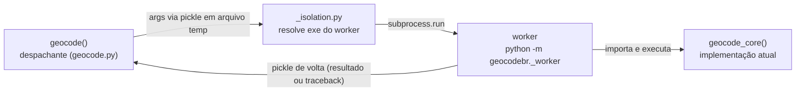

# Plano de ação — `geocode()` Python no Windows: deterioração entre chamadas + nível absoluto

**Data:** 2026-09-08 · **Status:** PROPOSTO — revisão v2 do plano (escopo enxuto acordado)
**Insumos:** [diagnóstico fechado](../diagnoses/2026-09-04_geocode-deterioracao-python-diagnostico.md) (E1–E5) · [plano antigo de isolamento](2026-09-02_python_isolamento-subprocesso-geocode.md) (substituído por este)
**Decisões já tomadas com o usuário:**
1. **Isolar sempre** — cada `geocode()` roda em subprocesso novo em **todos** os SOs (paridade total com o `callr::r()` do R; Linux/macOS pagam ~1–3 s de overhead sem benefício de performance, aceito).
2. ~~Cadeia de fallbacks para o heap~~ — **P0 executado em 2026-09-08, resultado NEGATIVO**: `__COMPAT_LAYER=SEGMENTHEAP` não altera o desempenho (gap 1,14×/1,16× contra critério ≥ 2×; detalhes na Fase 0 e em `resultados_benchmark.md`).
3. **Escopo v1 enxuto (2026-09-08)** — v1 entrega isolamento + detecção de heap com aviso + opt-in manual via `GEOCODEBR_WORKER_PY`. O **patch automático de exe fica descrito para a v2** (seção própria no fim), sem implementação agora.

## Diagnóstico em uma linha

O heap NT legacy do `python.exe` (fixado no image load pelo manifest, imutável em runtime) degrada sob alocação/liberação multithread intensa do DuckDB: deterioração progressiva entre chamadas no mesmo processo (E4: 12,8×) **e** nível absoluto 4,6× pior por chamada. Isolar o processo zera a deterioração; optar o worker pelo Segment Heap devolve o nível (total 11:47 → 3:08 na base 10M). Windows-only (E5).

## Arquitetura (v1)

O worker herda `stdout`/`stderr` (tqdm e verboso aparecem) e roda no interpretador **base** resolvido (pegadinha do launcher de venv). O pacote **nunca** escreve no diretório do interpretador na v1 — o ganho de nível com Segment Heap é opt-in do usuário (env var), com a receita no README.

### Resolução do exe do worker (Windows; non-Windows ignora)

| situação | comportamento |
|---|---|
| non-Windows | worker = interpretador real (`sys.base_prefix` em venv) |
| Windows + `GEOCODEBR_WORKER_PY` setado | worker = exe apontado pela env (cópia patcheada criada **pelo usuário**, uma vez) |
| Windows + exe que já declara SegmentHeap (futuro CPython) | worker = exe real (nada a fazer) |
| Windows + heap legacy (caso comum) | worker = exe real + **aviso** no `verboso` apontando para a receita do README |

Detecção de heap: scan de bytes do exe por `SegmentHeap` (mesma lógica de `verifica_deterioracao.py`); o banner do worker informa o estado (`SegmentHeap: sim/não/não aplicável`). A estratégia `__COMPAT_LAYER=SEGMENTHEAP` foi testada e **descartada** — ver Fase 0.

---

## Fase 0 — Probe `__COMPAT_LAYER` (P0) — EXECUTADO 2026-09-08: SEM EFEITO

Probe implementado em `python-package/benchmarks/verifica_segment_heap_compat.py`
(workload canônico da issue, 8M × 6 joins, rodadas intercaladas NT/SH, 3 repetições
por configuração; smoke de 1M linhas não discrimina os heaps — usar a escala cheia).
Resultado na máquina de referência (Windows Server 2022, CPython 3.13.7, duckdb 1.5.3):

| threads | NT mediana | SH (`__COMPAT_LAYER`) mediana | gap | critério |
|---|---|---|---|---|
| 8 | 37,19 s | 32,52 s | 1,14× | ≥ 2× |
| 24 | 38,85 s | 33,60 s | 1,16× | ≥ 2× |

Sem efeito: os dois braços ficam no mesmo patamar, longe da referência do exe
patcheado (~8,9–9,7 s em 8t; ~7–7,7 s em 24t), e ambos exibem a assinatura do heap
legacy (joins cada vez mais lentos, ~1 s → ~11 s; mais threads não ajuda).

Observação de API (não muda o veredito): com o layer no env, `HeapQueryInformation`
classe `HeapCompatibilityInformation` sobre o heap *default* do processo retorna
2 (Segment Heap) — o shim **é aplicado** ao heap default, mas o wall do duckdb não
muda. Hipótese mecânica mais consistente: o shim não alcança o heap criado pelo
UCRT no startup (`HeapCreate`), por onde passam as alocações do duckdb
(`_malloc_base` → `HeapAlloc(_crtheap)`); o opt-in via manifest (E4) é
process-wide e por isso funciona. Implicação prática: o caminho viável é o
manifest no exe hospedeiro (v1: opt-in manual; v2: automático).

**Melhoria em relação ao plano antigo:** a aposta zero-custo foi descartada por
evidência antes de qualquer implementação no pacote — sem risco de code path morto.

## Fase 1 — Isolamento em subprocesso (todos os SOs) — escopo v1

Módulos (espelhando `callr::r()`; código do plano antigo aproveitável com ajustes):

1. **`geocodebr/_worker.py`** (novo) — entrada `python -m geocodebr._worker <args.pkl> <result.pkl>`: carrega kwargs, roda `geocode_core`, devolve resultado ou traceback via pickle; imprime banner observável (`[geocodebr] worker isolado · python X.Y · SegmentHeap: sim/não/não aplicável`).
2. **`geocodebr/_isolation.py`** (novo) — lado do pai:
   - `run_isolated(kwargs)`: pickle de args para `TemporaryDirectory`, `subprocess.run`, leitura do resultado, relançamento de erro com traceback.
   - `_resolve_worker_exe()`: `GEOCODEBR_WORKER_PY` (se setado e existir) → senão interpretador real (`sys.base_prefix`/`python.exe` em venv, `sys.executable` caso contrário).
   - `_child_env()`: `PYTHONPATH` com a raiz do pacote importado no pai primeiro (instalação editável funciona — validado no plano antigo), depois `sys.path` do pai.
   - `_warn_heap()`: Windows-only; se o exe resolvido estiver no heap legacy, emite aviso uma vez por chamada (`verboso`), com a receita do README (criar cópia patcheada + setar `GEOCODEBR_WORKER_PY`).
3. **`geocode.py`** — corpo atual vira `geocode_core()` (assinatura idêntica); `geocode()` valida args, decide isolamento e despacha. As validações ficam no pai de propósito: erro de argumento deve falhar rápido no processo do usuário, sem pagar o startup do subprocesso.

Flags (v1): `GEOCODEBR_ISOLAR` (default `1`; `0` = in-process, para testes/debug) · `GEOCODEBR_WORKER_PY` (caminho de exe opcional; ex.: a cópia patcheada criada manualmente).

## Fase 2 — Detecção + documentação — escopo v1

1. Aviso e banner descritos na Fase 1 (reuso direto da checagem de bytes já existente no harness).
2. **README**: seção "Windows e performance" — o que é o problema (uma frase, link para duckdb#24027 e o diagnóstico), receita em 3 passos (baixar `patch_segment_heap.py` da reprodução pública, criar `python-geocodebr-sh.exe` ao lado do interpretador base, setar `GEOCODEBR_WORKER_PY`), e como desligar/isolar em testes. Nota de mitigação sem patch: `n_cores≈4` (medido em `resultados_benchmark.md`) para quem quiser reduzir o prejuízo do legacy sem criar exe.

## Fase 3 — Testes (v1)

1. `conftest.py`: fixture `autouse` com `GEOCODEBR_ISOLAR=0` (suíte rápida, mocks como `patch.object(geocode_mod, "download_cnefe", ...)` continuam funcionando).
2. Teste novo `test_isolation.py`: uma chamada de `geocode()` **com** isolamento ligado (CNEFE fake em `tmp_path`), travando args→resultado através da fronteira de processo e o banner do worker.
3. Paridade R↔Python (`test_r_python_parity.py`): roda com isolamento ligado de propósito (config de cache atravessa processos via arquivo) — paridade de comportamento real com o R.
4. Higiene (PR próprio, sem dependência): corrigir o vazamento cosmético do `.duckdb` vazio em `db.py` (`NamedTemporaryFile` + `unlink` não cobre a recriação pelo DuckDB).

## Fase 4 — Validação (Windows, base `sample_cad_unico` 10M)

1. **V1 — deterioração:** 10 rodadas × 3 modos com `verifica_deterioracao.py` — (a) in-process NT (deve reproduzir degradação ~12,8×), (b) isolado NT (plano no patamar da rodada 1), (c) isolado + `GEOCODEBR_WORKER_PY` apontando para a cópia patcheada (plano **e** no patamar rápido ~3 min).
2. **V2 — nível absoluto (opt-in):** `benchmark_sample.py` por fases no modo (c) ≈ linha `patch_heap` de `resultados_benchmark.md` (total 3:08; empates 0:05; fechamento 0:05). O modo default (b) fica no patamar da rodada 1 NT (~13 min na base 10M) — comportamento esperado e documentado.
3. **V3 — suíte:** 22/22 com fixture autouse + testes novos passando.
4. **V4 — paridade:** `test_r_python_parity.py` inalterado.
5. **V5 — CI:** estender `.github/workflows/deterioracao.yaml` (ou novo job) para rodar o modo isolado no `windows-latest`; checagem de banner `SegmentHeap: sim` apenas no job com worker patcheado (criado no próprio workflow com o `patch_segment_heap.py` público).

## Riscos (v1)

- **Nível absoluto permanece no patamar legacy no default** (deterioração resolvida): aceito na decisão de escopo; aviso + README mitigam a percepção, e a v2 fecha o gap.
- `GEOCODEBR_WORKER_PY` apontando para exe inválido/incompatível → falha visível ao lançar o worker com mensagem clara; sem fallback silencioso (a env é declaração explícita do usuário).
- Pickle de inputs grandes em memória (10M linhas) custa segundos — mesmo custo conceitual do `callr` no R; otimização futura possível (staging em parquet), fora de escopo agora.
- `busca_por_cep()`/`geocode_reverso()` não são isolados (igual ao R); aplicar o mesmo padrão depois, se necessário.

## v2 — Patch automático (descrito, FORA do escopo da v1)

Tudo o que a v1 não faz e que devolve o nível automaticamente, sem ação do usuário:

1. Portar/embutir o `patch_segment_heap.py` da reprodução duckdb#24027 como `geocodebr/_heap_patch.py` (~60 linhas stdlib, edição size-preserving do RT_MANIFEST, escreve **cópia** `python-geocodebr-sh.exe` ao lado do interpretador base — nunca alterar o original).
2. `_resolve_worker_exe()` ganha o ramo automático: Windows + heap legacy + flag de auto-patch (default ligado, env de escape para desativar) → criar/validar a cópia e usá-la; erros de escrita/permissão → degradar para exe real + aviso (a chamada nunca quebra por causa do heap).
3. Validez: sidecar `.sha256`; re-patch se o hash do exe mudar (upgrade de interpretador); não criar cópia se o original já declara SegmentHeap.
4. Riscos conhecidos (documentados desde o plano de 02/09): AV corporativo pode estranhar o exe copiado → flag de desativação + fallback; pasta base não-gravável (`Program Files`) → idem. Relocalização da cópia (`PYTHONHOME`/PATH) para Python em pasta de admin: condicionado a validação própria.
5. Candidatos a item futuro também: política de `n_cores` para worker legacy (sweep experimental desenhado e adiado em 2026-09-08 — a curva tempo × threads do legacy tem mínimo em ~4–6 threads na máquina de 24 cores; substituiria o default `None` no Windows sem heap) e isolamento de `busca_por_cep()`/`geocode_reverso()`.
6. Critério de ativação da v2: feedback da v1 (quantos usuários seguem a receita manual) + destino do aviso (`warnings` vs verboso).

## Ordem de execução e entregáveis (v1)

| # | passo | artefato |
|---|---|---|
| 1 | Probe P0 `__COMPAT_LAYER` — executado: sem efeito | `benchmarks/verifica_segment_heap_compat.py` + resultado em `resultados_benchmark.md` |
| 2 | Isolamento | `_worker.py`, `_isolation.py`, `geocode.py` refatorado |
| 3 | Detecção + docs | aviso/banner, README "Windows e performance" |
| 4 | Testes | `conftest.py`, `test_isolation.py`, fix `db.py` (PR separado) |
| 5 | Validação e CI | V1–V5 |
| — | v2 (futuro) | patch automático (`_heap_patch.py`), conforme seção v2 |
